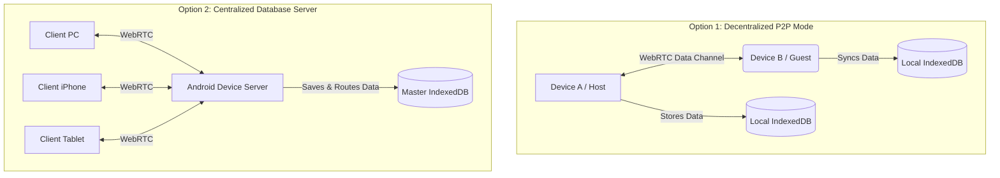

  
# 🌌 NexusDrop 
### *The Serverless P2P Enclave*

*A sleek, zero-backend, encrypted peer-to-peer chat and file-sharing ecosystem.*

---

## 📖 The Story Behind NexusDrop

It all started with an old Android device. 📱

I had a secondary, older mobile phone sitting in my drawer. It was a treasure trove of past memories—old pictures, critical PDF documents, and legacy notes. The problem? It didn't have a SIM card, it wasn't logged into WhatsApp, and it lacked any modern cloud-sharing applications. 

Every time I needed to extract a file or a note from that device to my current PC or main phone, it was a frustrating bottleneck. I didn't want to go through the hassle of downloading heavy third-party apps, creating new accounts, or wiring it up via USB just to share a simple image. 

I asked myself: **"Why can't I just open a webpage, generate a 4-digit PIN, and instantly bridge my devices together?"**

I wanted a solution that was:
1. **Serverless & Free**: No expensive cloud databases or backend servers to maintain.
2. **Persistent**: The old device could act as its own "host server" saving data locally.
3. **Frictionless**: Accessible from any browser in the world via a simple PIN.

That necessity birthed **NexusDrop**—a fully functional, WhatsApp-style chat and file-sharing enclave that runs entirely in the browser using WebRTC and IndexedDB.

---

## 🚀 What is NexusDrop?

**NexusDrop** is a static web application that turns your browser into a localized server node. Because it requires absolutely **zero backend infrastructure**, it can be hosted indefinitely for free on GitHub Pages. 

It operates in two distinct modes:
1. **P2P Mode**: Two devices connect directly to each other via WebRTC to exchange chat messages and heavy files in real-time.
2. **Database Server Mode**: Turn a spare Android device or PC into a permanent, centralized cloud server. It sits silently in the background, syncing all your global rooms, securely routing traffic, and storing files directly in its browser storage.

---

## ✨ Features

- 🟢 **Zero-Server Architecture**: Pure Peer-to-Peer (P2P) communication powered by `PeerJS` and WebRTC.
- ☁️ **"Database Server" Mode**: Transform any old device into a central hub. It uses the `Wake Lock API` to prevent the screen from sleeping while it acts as a global router and database for your other devices.
- 💾 **"Device-as-a-Server" Persistence**: Uses `localforage` (IndexedDB) to permanently store chat history and files locally. If you close the app and return days later, your data is exactly where you left it.
- 📱 **WhatsApp-Style Threading**: Native chat experience including **Swipe-to-Reply** on mobile (or double-click on PC), quoted message blocks, Image Lightboxes, and click-to-scroll navigation.
- 💻 **Markdown Support**: Rich text parsing for `**bold**`, `*italics*`, and `` `monospaced code blocks` ``. 
- 🔐 **Custom Secure Enclaves**: Ditch random IDs. You can create multiple secure rooms, choose your own Room Names, and set your own Custom 4-Digit PINs.
- 🗂️ **Persistent Sidebar**: Seamlessly switch between multiple ongoing rooms using the slide-out sidebar, just like a native messaging app.
- ⚡ **Frictionless Sharing**: One-click "Share Link" generates a magic URL (`?pin=XXXX`) that automatically connects and joins guests without them needing to type a password.
- 📝 **Local Scratchpad**: App opens instantly into an offline note-taking mode. Type notes or drop files immediately, and optionally secure/host them later without losing history.
- 📥 **Native "Save to Device"**: Bypass the browser viewer; files download directly to your Android, tablet, or iOS filesystem via native HTML5 download handling.
---

## 🛠️ Under the Hood & Architecture

Building NexusDrop required solving the classic "Static Site Data" problem. How do you persist data across devices without a database?

1. **WebRTC Data Channels**: Instead of relying on WebSockets through a Node.js backend, NexusDrop establishes a direct RTC connection between peers. This ensures minimal latency and maximum privacy.
2. **IndexedDB for Blob Storage**: Chat apps require handling large files. `localStorage` is capped at 5MB and only supports strings. NexusDrop utilizes `localforage` to asynchronously stream and store heavy binary `Blob` and `ArrayBuffer` objects directly into the browser's IndexedDB.

### Dual-Networking Topology

---

## 💻 Usage Instructions

Since NexusDrop is purely static, you can run it right now without installing a single package. Simply double-click `index.html` to open it in your browser, or host it on GitHub Pages for global access.

### The Local Scratchpad
The app instantly opens to a functional offline chat interface. Drop files and type notes immediately. Everything is saved to your local browser.

### Option 1: Decentralized P2P Mode
1. **Host a Secure Room:**
   - Click the warning banner at the top to secure your scratchpad.
   - Enter a **Room Name** and choose a **Custom 4-digit PIN**.
   - Your local scratchpad history automatically migrates to the secure room!
2. **Join a Room:**
   - On Device B, open the sidebar and click **Join P2P**.
   - Enter the custom PIN.
   - Watch the UI instantly sync your chat history! 

### Option 2: Centralized Database Server Mode
*Want to use an old Android device as a permanent cloud server?*
1. **Start the Server Daemon:**
   - On your spare device, open the sidebar and click **Initialize DB Server Mode**.
   - Enter a Server PIN (e.g., `1483`). The UI will transform into a hacker-style Server Dashboard and request a Screen Wake Lock. Leave this device plugged in.
2. **Connect as a Client:**
   - On your PC or iPhone, open the sidebar and click **Connect to DB Server**.
   - Enter your Server PIN (`1483`).
   - The Database Server will instantly sync a master list of all rooms to your device! Any messages or files you send in *any* room will now be automatically routed to the Android device for permanent storage.

> **Note on Persistence**: Unless you are using a dedicated Database Server, Device A (the Host) must have the NexusDrop tab open to facilitate the P2P WebRTC handshake if Device B wants to download files at a later date.

---

## 🎯 Why This Project Matters

For recruiters and developers looking at this repository, **NexusDrop** demonstrates a deep understanding of modern web capabilities:
- **Problem Solving**: Identifying a real-world friction point and engineering a lightweight, targeted solution.
- **Advanced Browser APIs**: Moving beyond basic DOM manipulation to utilize WebRTC, File Readers, `ArrayBuffers`, and asynchronous IndexedDB storage.
- **Architectural Constraints**: Successfully designing a stateful application within a stateless, serverless environment.

---

## 📫 Let's Connect

If you found this project interesting, want to discuss web architecture, or have an exciting opportunity, I'd love to have a word with you!

- **Email**: [theegalavijay18@gmail.com](mailto:theegalavijay18@gmail.com)
- **LinkedIn**: [Vijay Kumar Theegala](https://www.linkedin.com/in/vijay-kumar-theegala-69b7bb190)

---
*Built with passion, necessity, and vanilla JavaScript.* 👨‍💻
